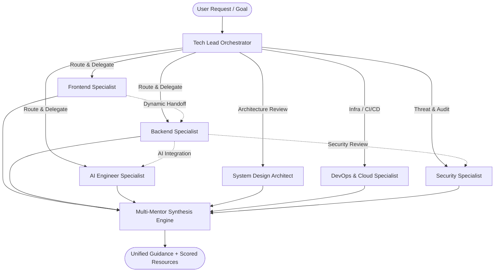

<div align="center">


# SkillFarm

**Production-Grade AI Engineering Mentorship & Adaptive Learning Platform**

*Plant knowledge. Grow skills. Ship real things.*

[](https://skillfarm.in)
[](https://nextjs.org)
[](https://react.dev)
[](https://typescriptlang.org)
[](https://tailwindcss.com)
[](https://neon.tech)
[](https://upstash.com)
[](https://cloudflare.com)
[](https://vercel.com)
[](LICENSE)

🌐 **[skillfarm.in](https://skillfarm.in)**

</div>

---

## 📖 Overview

**SkillFarm** replaces generic AI chat with a **coordinated team of six specialized engineering mentors** — each an expert in their domain — orchestrated by an intelligent Tech Lead agent.

You describe your goal or ask any engineering question. The orchestrator analyzes intent, selects the right specialist(s), runs parallel consultations for cross-domain architectural questions, performs seamless mentor handoffs mid-conversation, and synthesizes a single unified response enriched with real-time evaluated learning resources — all personalized to your background and long-term memory.



---

## ✨ Key Platform Features

### 1. 🤖 Six-Specialist AI Mentor Team & Orchestration

Six domain-expert mentors, each with a distinct system prompt, expertise set, and color identity:

| Mentor | Domain | Expertise |
|---|---|---|
| 🟣 **AI Engineer** | LLMs, RAG & Agents | LLM APIs, RAG pipelines, embeddings, evaluation, streaming |
| 🔵 **Backend Engineer** | APIs, DBs & Auth | Node.js, HTTP/REST, databases, auth, caching, testing |
| 🩷 **Frontend Engineer** | React & UI | React, Next.js, TypeScript, styling, performance, a11y |
| 🟢 **DevOps / Cloud** | Infra & Deploy | Docker, CI/CD, cloud, monitoring, secrets, infrastructure |
| 🔴 **Cybersecurity** | AppSec & OWASP | OWASP, authZ, API security, secrets, vulnerabilities |
| 🟡 **System Design** | Architecture | Scalability, data modeling, trade-offs, production readiness |

- **Tech Lead Router**: LLM-powered intent classification selects 1–3 specialists per query using structured Zod output; deterministic keyword fallback when no LLM key is configured.
- **Parallel Synthesis**: Multiple mentors consulted simultaneously via `Promise.all` for cross-domain questions; streamed into one unified answer.
- **Dynamic Handoffs**: Mid-conversation mentor transitions (e.g. Backend → Security → System Design) with both LLM-detected and explicit `[[HANDOFF:mentor:reason]]` token parsing.
- **Multi-Provider AI**: Supports Google Gemini, OpenAI, and Anthropic Claude with per-role model customization. User-controlled model selector in chat.

### 2. 🗺️ Concept-First Personalized Roadmap

- **LLM-Generated Curricula**: Week-by-week learning plan (2–12 weeks) generated from your goal, current level, known skills, weekly hours, and learning style using `generateObject` with a detailed Zod schema.
- **Concept-First Design**: Each week covers mental models, concepts, and learning objectives *before* applying them to the capstone project.
- **Static Track Fallback**: Pre-built engineering tracks (Backend, Frontend, AI, DevOps) work even without an LLM API key.
- **Interactive Tracking**: Node status transitions (locked → current → completed), search & filter, inline editing, and practical task briefs.
- **Accidental Wipe Protection**: 2-step confirmation modal with full impact breakdown before regeneration.

### 3. 🏗️ Capstone Project Hub

- **Roadmap-Coupled Projects**: One unified capstone project built in parallel with the roadmap — every week's learning maps to concrete project tasks.
- **Week-by-Week Task Tracker**: Task checklist per week, feature-completed labels, mentor assignment per week, GitHub repo URL linking.
- **Progression System**: Week unlocking tied to roadmap node progression.

### 4. 📄 Resume Intelligence & PII Scrubbing

- **PDF & Text Parsing**: Extracts text from `.pdf` and plain-text resumes via `pdf-parse-fork`.
- **Automatic PII Sanitization**: Strips phone numbers, email addresses, physical addresses, date of birth, and national IDs before any analysis or storage.
- **LLM Skill Extraction**: Structured extraction of tech stack, work history, and proficiency levels.
- **Cloudflare R2 Storage**: Deterministic single-object storage at `resumes/{userId}/active-resume.ext` with automatic in-place replacement lifecycle.
- **Mem0 Sync**: Extracted resume data is synced to long-term memory — AI mentors know your real work history.

### 5. 🧠 Long-Term Memory (Mem0 & PostgreSQL)

- Automatically builds a knowledge of your strengths, weak areas, and past architectural decisions across every chat session.
- Dual persistence: **Mem0 Cloud API** (semantic deduplication via `infer=true`) + **Neon PostgreSQL** `user_memories` table.
- Memory is injected into every mentor prompt via `getDeepUserContext()` — mentors always have your context.
- Full memory control in **Settings**: view, search, filter by category, export to JSON, or delete individual memory points with confirmation safeguards.

### 6. 🔍 Multi-Source Resource Discovery (6-Metric Scoring)

Every learning resource is retrieved from multiple live sources and evaluated across 6 quality dimensions:

| Dimension | Weight | Description |
|---|---|---|
| Authority | 25% | Official docs, GitHub, known platforms score higher |
| Freshness | 20% | Age-weighted scoring favoring recently updated content |
| Technical Accuracy | 20% | Heuristic-based accuracy assessment |
| Practical Value | 15% | Code examples, projects, tutorials flagged |
| Beginner-Friendliness | 10% | Step-by-step, crash course, beginner signals |
| Community Signal | 10% | GitHub stars, YouTube, community engagement |

- **Sources**: Tavily Web Search, GitHub REST API (stars, description, `updated_at`), YouTube Data API v3
- **Caching**: Upstash Redis with 1-hour TTL per query fingerprint; memory fallback
- **Context-Aware**: Resources page is auto-seeded from the current roadmap topic

### 7. 🛡️ Guest Sandbox & Storage Isolation

- Ephemeral Upstash Redis sandbox with 2-hour TTL — full roadmap, chat, profile, and resources available without creating an account.
- Strict storage isolation: guest activity never writes to production PostgreSQL or Mem0.
- IP abuse protection: burst limits per 10-minute window.
- Guest session limits: 1 roadmap, 3 conversations, 20 total messages, 2 research runs, 1 resume upload.

### 8. 🔐 Authentication & Security

- **Google OAuth 2.0** via Auth.js v5 with DrizzleAdapter (database sessions in production, JWT in preview)
- **Email + OTP** sign-in/sign-up flow via Nodemailer
- **Custom signed sessions** using `jose` JWS for password-reset and OTP flows
- **Password reset** & **email verification** flows fully implemented
- **Global AI Security Policy**: A base system prompt prepended to every mentor, orchestrator, and synthesizer prompt at module load time — enforcing prompt injection resistance, instruction hierarchy, and scope guarding (blocks medical, legal, financial off-topic queries)

### 9. ⚡ Rate Limiting & Usage Quotas

- Sliding-window rate limiters (Upstash Redis INCR/EXPIRE) per feature per user
- In-memory sliding window fallback when Redis is unconfigured
- Feature quotas: mentor messages, research runs, roadmap generations, resume uploads — configurable via `src/config/rate-limits.ts`
- Dashboard quota display with live usage percentages

### 10. 📊 Dashboard & Streak Tracking

- Personalized command center: streak tracker (Redis + fallback), roadmap progress %, current topic, evaluated resource pack for current node, and next action card.
- Real activity streak computed from daily Redis sets with 7-day visual history.

---

## 🛠️ Architecture & Tech Stack

| Layer | Technologies & Services |
|---|---|
| **Frontend & Routing** | Next.js 16.3 (App Router), React 19, TypeScript 5, Tailwind CSS v4, shadcn/ui, Lucide React |
| **Authentication** | Auth.js v5 (Google OAuth 2.0), Email OTP (Nodemailer), Custom signed sessions (`jose` JWS) |
| **Relational Database** | Neon PostgreSQL, Drizzle ORM 0.45, Drizzle Kit (schema push & migrations) |
| **Object Storage** | Cloudflare R2 (AWS S3-compatible SDK), Deterministic in-place resume lifecycle |
| **Cache, Rate Limits & Sandbox** | Upstash Redis (sliding-window rate limiters, research cache, guest sandbox, streak tracking) |
| **AI & LLM Orchestration** | Vercel AI SDK v6, Google Gemini (3.5 Flash Lite), OpenAI (GPT-4o Mini), Anthropic Claude (dev) |
| **Personalized Memory** | Mem0 Cloud API (semantic deduplication) + Neon PostgreSQL `user_memories` table |
| **Research Providers** | Tavily Web Search, GitHub REST API v3, YouTube Data API v3 |
| **PDF Processing** | `pdf-parse-fork` for server-side PDF text extraction |
| **Data Validation** | Zod v4 — runtime env, API endpoints, agent structured outputs |
| **Deployment** | Vercel (Next.js native), Node.js ≥ 20.9 |

---

## 📁 Project Structure

```text
SkillFarm/
├── src/
│   ├── app/
│   │   ├── page.tsx                    # Landing page
│   │   ├── login/                      # Google OAuth + OTP + Guest demo entry
│   │   ├── signup/                     # Email sign-up
│   │   ├── verify-email/               # OTP email verification
│   │   ├── forgot-password/            # Password reset request
│   │   ├── reset-password/             # Password reset via signed token
│   │   ├── dashboard/                  # Personalized command center & metrics
│   │   ├── chat/                       # Multi-mentor streaming orchestrator UI
│   │   ├── roadmap/                    # Interactive concept-first curriculum
│   │   ├── knowledge/                  # Concept dependency graph
│   │   ├── resources/                  # 6-metric evaluated research discovery
│   │   ├── projects/                   # Capstone project hub & task tracker
│   │   ├── settings/                   # Memory manager, resume viewer, LLM controls
│   │   ├── team/                       # Team page
│   │   ├── privacy/                    # Privacy policy
│   │   ├── terms/                      # Terms of service
│   │   └── api/
│   │       ├── auth/                   # Auth.js handlers
│   │       ├── chat/                   # Streaming orchestrator endpoint
│   │       ├── roadmap/                # Roadmap CRUD & generation
│   │       ├── projects/               # Capstone project API
│   │       ├── resources/              # Research & resource scoring
│   │       ├── settings/               # Memory & resume API
│   │       ├── conversations/          # Chat history persistence
│   │       ├── account/                # Account management
│   │       └── streak/                 # Activity streak tracking
│   ├── agents/
│   │   ├── base-system-prompt.ts       # Global security policy (prepended to all mentors)
│   │   ├── mentors/
│   │   │   ├── ai/prompt.ts            # AI Engineer specialist prompt
│   │   │   ├── backend/prompt.ts       # Backend Engineer specialist prompt
│   │   │   ├── frontend/prompt.ts      # Frontend Engineer specialist prompt
│   │   │   ├── devops/prompt.ts        # DevOps/Cloud specialist prompt
│   │   │   ├── security/prompt.ts      # Cybersecurity specialist prompt
│   │   │   ├── system-design/prompt.ts # System Design architect prompt
│   │   │   ├── index.ts                # Central mentor registry & prompt composition
│   │   │   └── tools.ts                # Untrusted data wrappers
│   │   ├── orchestrator/
│   │   │   ├── index.ts                # Main orchestrate() & runOrchestratedChat()
│   │   │   ├── router.ts               # LLM routing + keyword fallback
│   │   │   ├── synthesizer.ts          # Parallel synthesis + streaming
│   │   │   ├── handoff.ts              # Mid-conversation handoff detection
│   │   │   └── prompt.ts               # Router & synthesizer system prompts
│   │   ├── roadmap/
│   │   │   └── generator.ts            # Concept-first roadmap LLM generator (+ static tracks)
│   │   ├── projects/
│   │   │   └── generator.ts            # Capstone project generator
│   │   └── research/
│   │       ├── research.ts             # Unified search → dedupe → score → cache
│   │       ├── scorer.ts               # 6-metric weighted resource scorer
│   │       ├── topic-research.ts       # Topic-aware research for dashboard/resources
│   │       └── roadmap-research-scheduler.ts
│   ├── components/
│   │   ├── chat/
│   │   │   ├── chat.tsx                # Full chat interface with mentor routing UI
│   │   │   ├── conversation-history.tsx# Conversation list & history
│   │   │   ├── markdown.tsx            # Formatted markdown message renderer
│   │   │   └── model-selector.tsx      # In-chat LLM provider/model switcher
│   │   ├── dashboard/                  # Stats cards, mentor team compact, streak
│   │   ├── layout/                     # Sidebar, header, responsive nav
│   │   ├── profile/                    # Learning profile form & regeneration modal
│   │   ├── resume/                     # Upload dropzone, resume card, formatted viewer
│   │   ├── roadmap/
│   │   │   └── roadmap-view.tsx        # Interactive roadmap (1047 lines)
│   │   ├── projects/
│   │   │   └── projects-hub.tsx        # Capstone project task hub (715 lines)
│   │   ├── resources/                  # Resource cards, research panel
│   │   ├── knowledge/                  # Knowledge graph visualization
│   │   ├── settings/                   # Memory manager, account quota display
│   │   └── ui/                         # shadcn/ui design system primitives
│   ├── config/
│   │   ├── mentors.ts                  # Mentor definitions (SSOT for UI + orchestrator)
│   │   ├── models.ts                   # LLM provider & model catalog (SSOT)
│   │   ├── plans.ts                    # Subscription plan & quota configuration
│   │   ├── rate-limits.ts              # Rate limit rules per feature
│   │   ├── auth.ts                     # Auth environment config
│   │   ├── email.ts                    # Email service config
│   │   └── site.ts                     # Site metadata (domain, name, etc.)
│   ├── db/
│   │   ├── index.ts                    # Drizzle DB client
│   │   └── schema/
│   │       ├── users.ts                # Auth.js tables (user, account, session, verificationToken)
│   │       ├── learning.ts             # learning_profiles, roadmaps, roadmap_nodes, projects,
│   │       │                           # user_progress, user_memories, user_resumes, knowledge_nodes
│   │       ├── conversations.ts        # Chat conversations & messages
│   │       └── resources.ts            # Cached resource records
│   └── lib/
│       ├── auth.ts                     # Auth.js v5 config + custom session bridge
│       ├── session.ts                  # Custom signed session (jose JWS)
│       ├── password-auth.ts            # Email/OTP + password reset flows
│       ├── email-service.ts            # Nodemailer transactional email
│       ├── guest.ts                    # Ephemeral Redis guest sandbox engine (420 lines)
│       ├── rate-limit.ts               # Sliding-window rate limiter (Redis + memory fallback)
│       ├── redis.ts                    # Upstash Redis client
│       ├── cache.ts                    # Research result caching helpers
│       ├── streak.ts                   # Daily activity streak tracker (Redis)
│       ├── learning-profile.ts         # Profile persistence (DB + Redis guest + memory fallback)
│       ├── roadmap-store.ts            # Roadmap persistence (DB + Redis guest + memory fallback)
│       ├── project-store.ts            # Capstone project persistence
│       ├── chat-store.ts               # Conversation & message persistence
│       ├── handoff-store.ts            # Mentor handoff event storage
│       ├── subscription.ts             # Plan tier & quota management
│       ├── scope-guard.ts              # Off-topic query blocker
│       ├── users.ts                    # ensureDbUser helper
│       ├── ip.ts                       # IP extraction for rate limiting
│       ├── env.ts                      # Zod-validated environment schema
│       ├── observability.ts            # Logging wrapper
│       ├── llm/
│       │   ├── registry.ts             # Provider registry + auto-detection
│       │   ├── index.ts                # getLlmModel(), isLlmConfigured()
│       │   └── providers/              # Gemini, OpenAI, Anthropic adapters
│       ├── memory/
│       │   ├── mem0.ts                 # Mem0 Cloud + PostgreSQL memory engine
│       │   ├── ingestion.ts            # getDeepUserContext() — prompt enrichment
│       │   └── resume-parser.ts        # Memory parser for resume data
│       ├── resume/
│       │   ├── index.ts                # High-level processAndStoreResume()
│       │   ├── pdf-extractor.ts        # PDF text extraction
│       │   ├── pii-scrubber.ts         # PII redaction (email, phone, address, DOB, ID)
│       │   ├── llm-extractor.ts        # Structured skill & experience extraction
│       │   ├── mem0-sync.ts            # Resume → Mem0 memory sync
│       │   └── storage.ts              # R2 upload/download/delete lifecycle
│       ├── storage/
│       │   └── r2.ts                   # Cloudflare R2 S3 client
│       └── search/
│           ├── tavily.ts               # Tavily web search provider
│           ├── github.ts               # GitHub REST API search
│           └── youtube.ts              # YouTube Data API v3 search
├── drizzle/                            # Drizzle migration files
├── drizzle.config.ts                   # Drizzle Kit configuration
├── middleware.ts                       # Next.js route protection & redirects
├── next.config.ts                      # Next.js configuration
├── components.json                     # shadcn/ui configuration
├── sample.env                          # Fully commented environment template
├── SETUP.md                            # Production deployment & infrastructure guide
└── README.md
```

---

## ⚡ Quick Start

### Prerequisites

- **Node.js** `≥ 20.9.0` (LTS recommended)
- **npm** `≥ 10.0.0`
- Free-tier accounts (all have free plans):
  - [Neon PostgreSQL](https://neon.tech) — database
  - [Upstash Redis](https://upstash.com) — cache, rate limits, guest sandbox
  - [Google Cloud Console](https://console.cloud.google.com) — OAuth 2.0 (for Google sign-in)
  - [Google AI Studio](https://aistudio.google.com) **or** [OpenAI](https://platform.openai.com) — at least one LLM API key

### 1. Clone & Install

```bash
git clone https://github.com/Ravindra-builds/SkillFarm.git
cd SkillFarm
npm install
```

### 2. Configure Environment

```bash
cp sample.env .env.local
```

Open `.env.local` and populate the required values. See the [Environment Variables](#-environment-variables) section below and [`SETUP.md`](SETUP.md) for detailed step-by-step instructions.

### 3. Initialize Database Schema

```bash
npm run db:push
```

### 4. Run Development Server

```bash
npm run dev
```

Open [http://localhost:3000](http://localhost:3000) in your browser.

> **Note:** The app works without any API keys using a full mock/fallback mode — roadmap generation uses static engineering tracks and chat uses deterministic keyword routing with mock responses. Add at least one LLM API key to enable live AI features.

---

## 🔑 Environment Variables

Copy `sample.env` to `.env.local`. The minimal required variables for a working local setup are:

```bash
# ── Required: Database ─────────────────────────────────────────
DATABASE_URL=postgresql://...          # Neon PostgreSQL connection string

# ── Required: Auth ─────────────────────────────────────────────
AUTH_SECRET=                           # Generate: npx auth secret
AUTH_GOOGLE_ID=                        # Google OAuth Client ID
AUTH_GOOGLE_SECRET=                    # Google OAuth Client Secret

# ── Required: Cache & Rate Limiting ────────────────────────────
UPSTASH_REDIS_REST_URL=                # Upstash Redis REST URL
UPSTASH_REDIS_REST_TOKEN=              # Upstash Redis REST Token

# ── At least one LLM Provider ──────────────────────────────────
GEMINI_API_KEY=                        # Google AI Studio API key  (recommended)
OPENAI_API_KEY=                        # OpenAI API key
ANTHROPIC_API_KEY=                     # Anthropic Claude (development only)

# ── Optional: Enhanced Features ────────────────────────────────
MEM0_API_KEY=                          # Mem0 Cloud (long-term memory)
TAVILY_API_KEY=                        # Tavily web search (resource discovery)
GITHUB_TOKEN=                          # GitHub PAT (resource discovery)
YOUTUBE_API_KEY=                       # YouTube Data API v3 (resource discovery)

# ── Optional: Resume Storage ───────────────────────────────────
CLOUDFLARE_R2_ACCOUNT_ID=
CLOUDFLARE_R2_ACCESS_KEY_ID=
CLOUDFLARE_R2_SECRET_ACCESS_KEY=
CLOUDFLARE_R2_BUCKET_NAME=

# ── Optional: Email (OTP & Password Reset) ─────────────────────
SMTP_HOST=
SMTP_PORT=
SMTP_USER=
SMTP_PASS=
EMAIL_FROM=

# ── Optional: Email (Resend alternative) ───────────────────────
RESEND_API_KEY=
```

See [`sample.env`](sample.env) for the complete list with full descriptions, and [`SETUP.md`](SETUP.md) for step-by-step account creation and configuration.

---

## 🧪 Testing & Verification

```bash
# Run all unit and integration test suites
npm test

# Run TypeScript type safety checks
npx tsc --noEmit

# Inspect and manage the database schema visually
npm run db:studio

# Lint the codebase
npm run lint
```

Test coverage includes: orchestrator routing (LLM + keyword fallback), guest sandbox isolation, sliding-window rate limiters, and resume PII scrubber.

---

## 🚀 Deployment to Production (Vercel)

[](https://vercel.com/new/clone?repository-url=https://github.com/Ravindra-builds/SkillFarm)

1. Push your repository to GitHub.
2. Import the project into [Vercel](https://vercel.com).
3. Add all environment variables in **Project Settings → Environment Variables** (see [`SETUP.md`](SETUP.md)).
4. Run `npm run db:push` to apply the PostgreSQL schema to Neon.
5. Deploy — Vercel auto-detects Next.js and configures the build.

> **Important:** High-cost models (such as GPT-4o and Gemini 3.5 Flash) and Anthropic Claude are disabled in the production model catalog (`src/config/models.ts`) to prevent accidental cost exposure. Production is locked to fast and cost-efficient models (**Gemini 3.5 Flash Lite** and **GPT-4o Mini**).

For full production infrastructure setup (Neon, Upstash, Cloudflare R2, Google OAuth, Mem0, Tavily, YouTube API), see [`SETUP.md`](SETUP.md).

---

## 🗺️ How It Works

```
1. You describe your engineering goal, current level, and weekly availability
         ↓
2. SkillFarm generates a personalized week-by-week roadmap with mental models,
   concepts, practical tasks, and a capstone project — all aligned to your goal
         ↓
3. Each week, access scored & context-relevant resources (docs, GitHub, YouTube)
   evaluated across 6 quality dimensions
         ↓
4. Ask your AI mentor team any engineering question — the orchestrator routes
   it to the right specialist(s); complex questions trigger multi-mentor consultation
         ↓
5. Build the capstone project in parallel — every week's learning connects
   directly to concrete project tasks
         ↓
6. Long-term memory accumulates across sessions — mentors always know
   your background, decisions, and growth
```

---

## 🤝 Contributing

Contributions are welcome. Please open an issue first to discuss what you'd like to change.

1. Fork the repository
2. Create a feature branch: `git checkout -b feature/your-feature`
3. Commit your changes: `git commit -m 'feat: add your feature'`
4. Push to the branch: `git push origin feature/your-feature`
5. Open a Pull Request

Please ensure `npm run lint` and `npx tsc --noEmit` pass before submitting.

---

## 📄 License

Distributed under the MIT License. See [`LICENSE`](LICENSE) for more information.

---

<div align="center">

Built with ❤️ by <a href="https://github.com/Ravindra-builds">Ravindra</a>

🌐 <a href="https://skillfarm.in">skillfarm.in</a>

</div>
