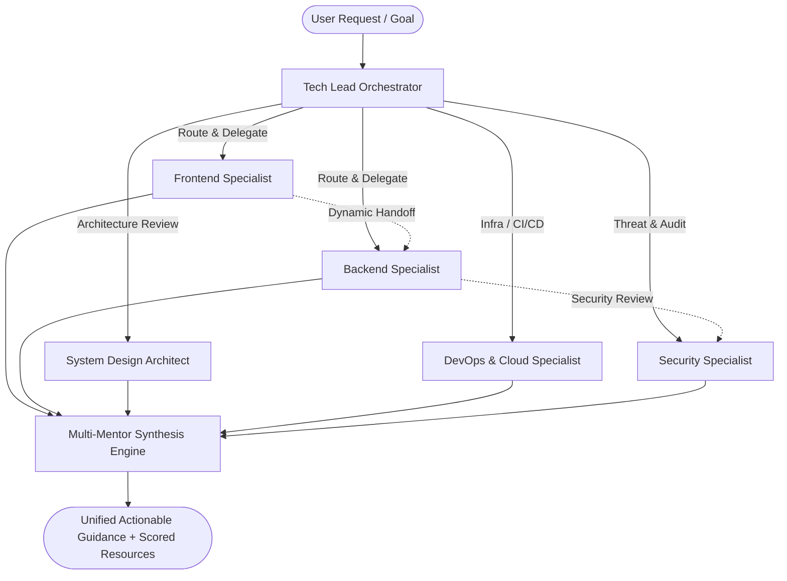

<div align="center">

# 🌾 SkillFarm

**Production-Grade AI Engineering Mentorship & Adaptive Learning Platform**

*Learn what matters, get guided by specialized AI mentors, build real-world systems.*

[](https://nextjs.org)
[](https://typescriptlang.org)
[](https://tailwindcss.com)
[](https://neon.tech)
[](https://upstash.com)
[](https://cloudflare.com)
[](LICENSE)

</div>

---

## 📖 Overview

**SkillFarm** replaces generic AI chat with a **coordinated team of specialized engineering mentors** orchestrated by an intelligent Tech Lead agent. 

Instead of choosing mentors manually, you describe your goal or ask complex engineering questions. The orchestrator analyzes intent, delegates to domain specialists (Frontend, Backend, System Design, DevOps, Security), executes parallel consultations for architectural reviews, performs seamless mentor handoffs, and synthesizes unified responses backed by real-time evaluated learning materials.



---

## ✨ Key Platform Features

### 1. 🤖 Multi-Mentor Orchestration & Handoffs
- **Tech Lead Router**: Dynamically matches prompts to domain specialists.
- **Parallel Synthesis**: Gathers simultaneous input from multiple mentors for architecture and full-stack challenges.
- **Dynamic Handoffs**: Visualized mentor-to-mentor transitions (e.g. Backend $\rightarrow$ Security review $\rightarrow$ Tech Lead synthesis) directly in the streaming chat interface.
- **Multi-Provider AI**: Supports Google Gemini, OpenAI, and Anthropic Claude with per-role provider customization.

### 2. 🗺️ Adaptive Roadmap & Knowledge Graph
- **Concept-First DAG Engine**: Generates customized curricula based on target goal, current proficiency, and weekly pace.
- **Interactive Tracking**: Real-time milestone progress tracking, node status transitions, and practical assignment briefs.
- **Accidental Wipe Protection**: 2-step confirmation modal with impact breakdowns protecting roadmap progress.

### 3. 📄 Resume Intelligence & PII Scrubbing
- **Automated Extraction**: Parses `.pdf` and text resumes to identify core tech stacks, work history, and suggested proficiency levels.
- **Sensitive Data Privacy**: Automatic PII sanitizer strips phone numbers, email addresses, and locations before analysis and storage.
- **Cloudflare R2 Storage**: In-place deterministic single-object storage (`resumes/{userId}/active-resume.ext`) with automatic cleanup of outdated files.
- **In-App Formatted Viewer**: Review structured experience matrices and project briefs directly from PostgreSQL without requiring public R2 endpoints.

### 4. 🧠 Long-Term Memory (Mem0 & PostgreSQL)
- Automatically remembers your skill strengths, weak points, and architectural decisions across chats.
- Full memory control in Settings: search, filter, export to JSON, or delete memory points with confirmation safeguards.

### 5. 🔍 Multi-Metric Resource Discovery
- Every scraped learning link is evaluated across **6 quality dimensions**:
  1. *Authority*
  2. *Freshness*
  3. *Technical Accuracy*
  4. *Practical Value*
  5. *Beginner-Friendliness*
  6. *Community Signal*
- Integrates Tavily, Exa, GitHub API, and YouTube Data API v3.

### 6. 🛡️ Guest Sandbox & Storage Isolation
- Ephemeral Upstash Redis sandbox allows guest testing with automatic TTL expiration.
- Strict isolation ensures guest activity never pollutes production PostgreSQL or Mem0 databases.

---

## 🛠️ Architecture & Tech Stack

| Layer | Technologies & Services |
|---|---|
| **Frontend & Routing** | Next.js 16 (App Router), React 19, TypeScript, Tailwind CSS v4, shadcn/ui, Lucide Icons |
| **Authentication** | Auth.js v5 (Google OAuth 2.0), Resend OTP, Signed Session Cookies (`jose` JWS) |
| **Relational Database** | Neon PostgreSQL, Drizzle ORM, Drizzle Kit |
| **Object Storage** | Cloudflare R2 (S3-compatible SDK), In-place replacement lifecycle |
| **Cache & State** | Upstash Redis (Sliding-window rate limiters, semantic caching, guest sandbox) |
| **AI & LLM Orchestration** | Vercel AI SDK, Google Gemini (2.5 Flash/Pro), OpenAI (GPT-4o/mini), Anthropic Claude |
| **Personalized Memory** | Mem0 AI Memory Engine + Neon PostgreSQL relational vector store |
| **Research Providers** | Tavily Web Search, Exa AI, GitHub REST API, YouTube Data API v3 |
| **Data Validation** | Zod v3 schema validation (runtime environment, API endpoints, agent outputs) |

---

## 📁 Project Structure

```text
SkillFarm/
├── src/
│   ├── app/
│   │   ├── page.tsx                 # High-converting landing page
│   │   ├── login/                   # Google OAuth + OTP + Guest demo entry
│   │   ├── dashboard/               # Personalized command center & metrics
│   │   ├── chat/                    # Multi-mentor streaming orchestrator UI
│   │   ├── roadmap/                 # Interactive curriculum & milestone DAG
│   │   ├── knowledge/               # Concept dependency graph
│   │   ├── resources/               # 6-metric evaluated research discovery
│   │   ├── projects/                # Production project assignments & briefs
│   │   ├── settings/                # AI memory manager, resume viewer, LLM controls
│   │   └── api/                     # Edge & Node runtime REST routes
│   ├── agents/
│   │   ├── mentors/                 # 6 Mentor personas (Frontend, Backend, System Design, etc.)
│   │   ├── orchestrator/            # Intent router, parallel query engine, handoff coordinator
│   │   └── research/                # Resource scoring engine (6 metrics)
│   ├── components/
│   │   ├── chat/                    # Chat windows, handoff ribbons, message stream
│   │   ├── layout/                  # Sidebar navigation, responsive headers, theme toggle
│   │   ├── profile/                 # Learning profile editor & regeneration modal
│   │   ├── resume/                  # Upload dropzone, active resume card, formatted viewer
│   │   ├── roadmap/                 # Milestone nodes, progress timeline, confirm modal
│   │   └── ui/                      # shadcn/ui design system primitives
│   ├── db/
│   │   └── schema/                  # PostgreSQL Drizzle ORM tables (users, resumes, roadmaps, etc.)
│   └── lib/
│       ├── auth.ts                  # Auth.js configuration & provider callbacks
│       ├── guest.ts                 # Ephemeral Redis guest sandbox engine
│       ├── rate-limit.ts            # Centralized sliding-window rate limiters
│       ├── resume/                  # PII scrubbing, PDF extractor, storage controller
│       ├── storage/r2.ts            # Cloudflare R2 client & lifecycle manager
│       └── roadmap-store.ts         # Relational database persistence
├── sample.env                       # Fully commented environment template
├── SETUP.md                         # Production deployment & infrastructure guide
└── README.md                        # Project documentation
```

---

## ⚡ Quick Start

### Prerequisites
- **Node.js**: `≥ 20.9.0` (LTS recommended)
- **npm**: `≥ 10.0.0`
- Accounts (Free tiers available): [Neon PostgreSQL](https://neon.tech), [Upstash Redis](https://upstash.com), [Google Cloud](https://console.cloud.google.com), [OpenAI](https://platform.openai.com) / [Google AI Studio](https://aistudio.google.com).

### 1. Clone & Install Dependencies
```bash
git clone https://github.com/Ravindra-builds/SkillFarm.git
cd SkillFarm
npm install
```

### 2. Configure Environment Variables
```bash
cp sample.env .env.local
```
*Open `.env.local` and populate your credentials. Refer to [`SETUP.md`](SETUP.md) for step-by-step instructions.*

### 3. Initialize Database Schema
```bash
npm run db:push
```

### 4. Run Development Server
```bash
npm run dev
```
Open [http://localhost:3000](http://localhost:3000) in your browser.

---

## 🧪 Testing & Verification

SkillFarm maintains comprehensive test coverage across agent routing, guest sandbox isolation, rate limiters, and resume parsers.

```bash
# Run all unit and integration test suites
npm test

# Run TypeScript type safety checks
npx tsc --noEmit

# Inspect database schema with Drizzle Studio
npm run db:studio
```

---

## 🚀 Deployment to Production (Vercel)

[](https://vercel.com/new/clone?repository-url=https://github.com/Ravindra-builds/SkillFarm)

1. Push your repository to GitHub.
2. Import project into [Vercel](https://vercel.com).
3. Set the environment variables in **Project Settings $\rightarrow$ Environment Variables** (see [`SETUP.md`](SETUP.md)).
4. Execute `npm run db:push` to apply your PostgreSQL schema to Neon.
5. Deploy!

---

## 📄 License

Distributed under the MIT License. See [`LICENSE`](LICENSE) for more information.

---

<div align="center">
Built with ❤️ by <a href="https://github.com/Ravindra-builds">Ravindra</a>
</div>
